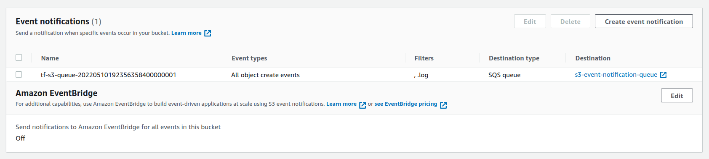

# poc-aws-s3-notification-sqs

### Event Notification




### notification object
```json
{
  "Service":"Amazon S3",
  "Event":"s3:TestEvent",
  "Time":"2022-05-10T19:23:56.905Z",
  "Bucket":"poc-aws-s3-notification-sqs-bucket",
  "RequestId":"","HostId":""
}
```

